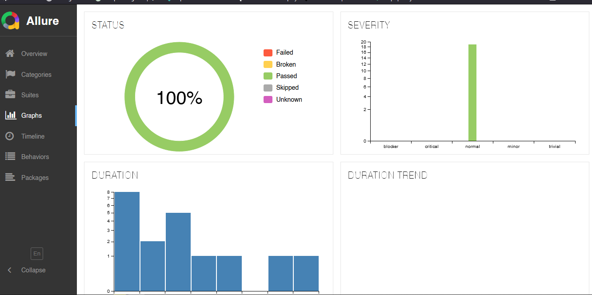

<!-- Improved compatibility of back to top link: See: https://github.com/othneildrew/Best-README-Template/pull/73 -->

<a id="readme-top"></a>

<!-- PROJECT LOGO -->
<br />
<div align="center">
   <a href="https://webdriver.io/">
        
    </a>

  <h3 align="center">SAUCEDEMO PROJECT AUTOMATION TESTING</h3>

  <p align="center">
    From the Project Requirement Document by Growia 
    <br />
    <a href="https://growiaeducationid.atlassian.net/jira/software/projects/CSD/boards/3/timeline"><strong>Explore the docs »</strong></a>
    <br />
    <a href="https://drive.google.com/file/d/1zpF44biwa6IZ57P8M26gncAufxLtHFB3/view?usp=sharing">View Timeline</a>
    ·
    <a href="https://drive.google.com/file/d/1AbqzAPNeKOEG0eTcerKitU-WyWYSupXB/view?usp=sharing">Epic & User Story</a>
    ·
  </p>
</div>

<!-- TABLE OF CONTENTS -->
<details>
  <summary>Table of Contents</summary>
  <ol>
    <li>
      <a href="#about-the-project">About The Project</a>
      <ul>
        <li><a href="#built-with">Built With</a></li>
      </ul>
    </li>
    <li>
      <a href="#getting-started">Getting Started</a>
      <ul>
        <li><a href="#prerequisites">Prerequisites</a></li>
        <li><a href="#installation">Installation</a></li>
      </ul>
    </li>
    <li><a href="#roadmap">Roadmap</a></li>
    <li><a href="#contact">Contact</a></li>
    <li><a href="#reporting">Reporting</a></li>
  </ol>
</details>

<!-- ABOUT THE PROJECT -->

## About The Project

SauceDemo is an e-commerce website that is currentlyin very early development stages. The MVP for this website was creating a login feature and a homepage showcasing a list of items.
But now it has been developed with the followiing features:

- Login Feature.
- Homepage
- Item Detail
  After the 3 features above, the website is now recieving 2 new features:
- Adding and managing items on the shopping cart
- Quick checkout feature (without payment)

<p align="right">(<a href="#readme-top">back to top</a>)</p>

### Built With

This section should list any major frameworks/libraries used to bootstrap your project.

- [![JS][JavaScript]][js-url]
- [![wdio][webdriverio]][wdio-url]
- [![npm][nodejs]][npm-url]

<p align="right">(<a href="#readme-top">back to top</a>)</p>

<!-- GETTING STARTED -->

## Getting Started

Open jira project with this [link](https://growiaeducationid.atlassian.net/jira/software/projects/CSD/boards/3/timeline) then using login email: groqiastudents@gmail.com and password: Students001!

Create test case functional, component integration, system test, and regression test
Report any defect/potential defect found on the website or the PRD

### Prerequisites

- visual studio code
- JavaScript
- NodeJS
- npm
- Webdriverio, Mocha, Allure/JUnit

### Installation

_Start with download and install NodeJS from this link (https://nodejs.org/en)_

WebdriverIO is an all in one framework for your web app development. It enables you to run small and lightweight component tests as well as running e2e test scenarios in the browser or on a mobile device. This guarantees that you to do the testing in an environment used by your users.

1. Create a project folder
2. open the terminal and type
   ```sh
   npm init -y
   ```
3. Install webdriverio
   ```sh
   npm init wdio@latest . -- --yes
   ```
4. run the project
   ```sh
   npx wdio run
   ```

<p align="right">(<a href="#readme-top">back to top</a>)</p>

<!-- ROADMAP -->

## Roadmap

- [x] Getting Started
- [x] How to implement Page Object Model
- [x] Run WebdriverIO test from Jenkins
- [x] Add project to Git
- [ ] Run WebdriverIO tests from Jenkins using GitHub project

<p align="right">(<a href="#readme-top">back to top</a>)</p>

<!-- CONTACT -->

## Contact

Your Name - [tuangKarombang](https://x.com/tuangKarombang) - X

Project Link: [My Portfolio](https://github.com/tkarombang/MyPortfolio)

<p align="right">(<a href="#readme-top">back to top</a>)</p>

## Reporting

### Allure Reports

<a href="https://github.com/tkarombang/saucedemo-webdriverio/tree/main/img-results">
    
  </a>

<!-- MARKDOWN LINKS & IMAGES -->
<!-- https://www.markdownguide.org/basic-syntax/#reference-style-links -->

[linkedin-shield]: https://img.shields.io/badge/-LinkedIn-black.svg?style=for-the-badge&logo=linkedin&colorB=555
[linkedin-url]: https://linkedin.com/in/muhanaz
[JavaScript]: https://img.shields.io/badge/JS-javascript-blue?logo=javascript
[js-url]: https://www.javascript.com/
[webdriverio]: https://img.shields.io/badge/webdriver_io-orange
[wdio-url]: https://webdriver.io/
[nodejs]: https://img.shields.io/npm/v/npm.svg?logo=nodedotjs
[npm-url]: https://nodejs.org
